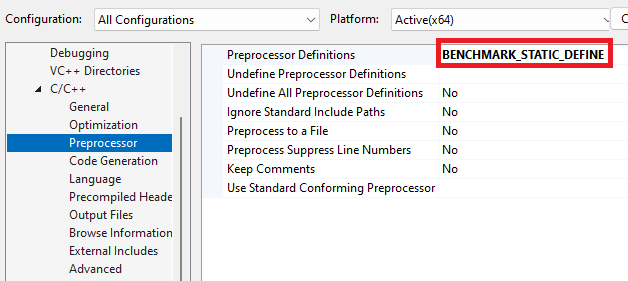
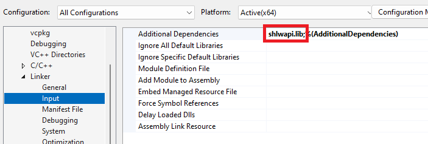

# ULP (Unit in the last place) for IEEE 754 64-bit floating-point numbers

- Efficient and reliable methods for rounded-interval arithmetic. S. L. Abrams, W. Cho, C.-Y. Hu, T. Maekawa, N. M. Patrikalakis, E. C. Sherbrooke and X. Ye. Computer-Aided Design, Vol. 30, No. 8, pp. 657-665, July 1998.


In the aforementioned paper, the authors presented algorithms to find ulp for double precision floating-point numbers and compared execution time with built-in functions and hardware rounding mode calculations.

`union`s are often used for type punning but it is not a recommended practice.

C.183: Don’t use a union for type punning (https://isocpp.github.io/CppCoreGuidelines/CppCoreGuidelines#c183-dont-use-a-union-for-type-punning)

cppreference.com (https://en.cppreference.com/w/cpp/language/union#Explanation)

`std::nextafter` and `std::bit_cast` were introduced in `C++11` and `C++20`, respectively.

A function to find ulp was written using `std::bit_cast` and compared with `std::nextafter` and calculations with `std::fesetround`.

```cpp
double get_ulp_bit_cast(double x)
{
    if (std::isnan(x) || std::isinf(x))
        return std::nan("");

    auto bits{ std::bit_cast<std::uint64_t>(x) };
    bits >>= 52;
    bits &= 0b0111'1111'1111; // get exponent
    if (bits > 52)
    {
        bits -= 52;
        bits <<= 52;
        return std::bit_cast<double>(bits);
    }

    if (bits == 0 || bits == 1)
    {
        return std::numeric_limits<double>::denorm_min();
    }

    // 2 <= exponent <= 52
    --bits;
    std::uint64_t ulp{ 1 };
    ulp <<= bits;

    return std::bit_cast<double>(ulp);
}
```

It was observed that `x + get_ulp_bit_cast(x) == std::nextafter(x, INFINITY)` for tested values.

However, calculations using `std::fesetround(FE_UPWARD)` or `std::fesetround(FE_DOWNWARD)` do not give the same results.

The benchmark results are as follows.

```
Run on(12 X 2995 MHz CPU s)
CPU Caches :
L1 Data 48 KiB(x6)
L1 Instruction 32 KiB(x6)
L2 Unified 1280 KiB(x6)
L3 Unified 18432 KiB(x1)

value = 3.14
--------------------------------------------------------------------
Benchmark                          Time             CPU   Iterations
--------------------------------------------------------------------
ulp_bit_cast                   0.277 ns        0.172 ns   1000000000
ulp_bit_cast_lookup_table      0.244 ns        0.141 ns   1000000000
add_ulp                        0.249 ns        0.109 ns   1000000000
nextafter                       5.61 ns         3.00 ns    213333333
test_add_upward                 27.1 ns         11.9 ns     44800000
test_add_downward               26.9 ns         12.9 ns     54539130
test_fesetround                 13.5 ns         6.73 ns    111502223

value = 1e-308
--------------------------------------------------------------------
Benchmark                          Time             CPU   Iterations
--------------------------------------------------------------------
ulp_bit_cast                   0.241 ns        0.109 ns   1000000000
ulp_bit_cast_lookup_table      0.252 ns        0.047 ns   1000000000
add_ulp                        0.243 ns        0.125 ns   1000000000
nextafter                       24.2 ns         17.9 ns     56000000
test_add_upward                 27.0 ns         18.1 ns     44800000
test_add_downward               26.9 ns         18.1 ns     64000000
test_fesetround                 13.5 ns         9.56 ns    107905377

value = 1e+308
--------------------------------------------------------------------
Benchmark                          Time             CPU   Iterations
--------------------------------------------------------------------
ulp_bit_cast                   0.282 ns        0.109 ns   1000000000
ulp_bit_cast_lookup_table      0.248 ns        0.141 ns   1000000000
add_ulp                        0.240 ns        0.078 ns   1000000000
nextafter                       5.62 ns         2.58 ns    503017543
test_add_upward                 27.1 ns         23.4 ns     32000000
test_add_downward               26.9 ns         9.84 ns     74666667
test_fesetround                 13.5 ns         11.3 ns     74666667

value = 0.0000459
--------------------------------------------------------------------
Benchmark                          Time             CPU   Iterations
--------------------------------------------------------------------
ulp_bit_cast                   0.266 ns        0.141 ns   1000000000
ulp_bit_cast_lookup_table      0.226 ns        0.078 ns   1000000000
add_ulp                        0.234 ns        0.078 ns   1000000000
nextafter                       5.70 ns         3.63 ns    224000000
test_add_upward                 27.0 ns         13.6 ns     44800000
test_add_downward               26.8 ns         18.1 ns     56000000
test_fesetround                 13.5 ns         4.12 ns    159288889
```

In the latest hardware and language version, a custom function to find ulp is faster than built-in functions and calculations in the different floating-point rounding mode.

## Development Environments

- CPU: Intel i5 12th Gen

- OS: Windows 11

- Compiler: Microsoft Visual Studio (64-bit) Version 17.9.0 Preview 1.0

## Library via vcpkg

- benchmark:x64-windows 1.8.3

## Extra Settings

Google benchmark is not out of the box. The following settings are needed.





## References:

- IEEE 754 (https://en.wikipedia.org/wiki/IEEE_754)

- Double-precision floating-point format (https://en.wikipedia.org/wiki/Double-precision_floating-point_format)

- Unit in the last place (https://en.wikipedia.org/wiki/Unit_in_the_last_place)
